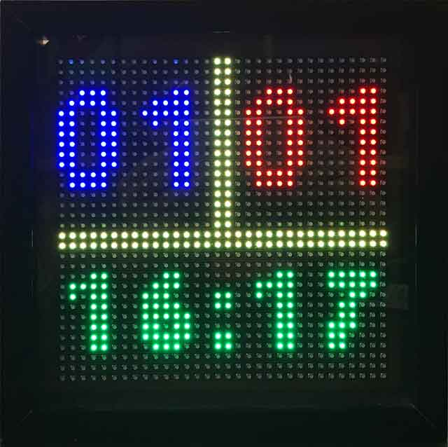

#TabelloneBot

Tabellone elettronico per biliardino

##Sorgenti tabellone

* [tabellone.py](Sorgente principale del programma che gira all'interno dei tabelloni)

##Sorgenti biliardino

* [biliardino.py](Sorgente principale del programma che gira all'interno del biliardino)
* [acmepins.py](Modulo di gestione dei pin di Arietta G25)
* [cronometro.py](Modulo per la misurazione del tempo di gioco trascorso)

##Pacchetti da installare 

[Python-Telegram-Bot](https://github.com/python-telegram-bot/python-telegram-bot) per interagire con [Telegram](https://telegram.org/)

	apt-get update
	apt-get install python-pip
	pip install python-telegram-bot

##Links

* [@TabelloneBot](https://telegram.me/TabelloneBot)
* [Pinout Arietta G25](http://pinout.acmesystems.it)
* [Acme Arietta G25](http://www.acmesystems.it/arietta)
* [Hardware per la realizzazione del tabellone](http://www.acmesystems.it/ledpanel)
* [Datasheet del diodo IR trasmettitore)(http://www.mouser.com/ds/2/239/S_110_E5208A-336877.pdf)
* [Datasheet del ricevitore IR](http://www.mouser.com/ds/2/427/tsop321-531469.pdf)
